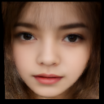

<html lang="ja">
    <head>
        <meta charset="utf-8" />
    </head>
    <body>
        <h1>
Facial Amimation
</h1>
        <h2>なにものか？</h2>
        

            顔の静止画像に表情をつけます。 
            Real_Time_Image_Animationの学習済モデルパラメータのリンクが切れていたり、依存するライブラリが多かったので、最低限のライブラリで動作するようにしてみました。 
             
            (入力)
             
            (出力)
             
        

        <h2>環境構築方法</h2>
        

            <h3>[1] ベース環境をダウンロード～解凍～配置する</h3>
            　<a href="https://github.com/anandpawara/Real_Time_Image_Animation">Real time Image Animation</a> 
            　Code → Download ZIP をクリックする。 
             
            　Real_Time_Image_Animation.zip を解凍し、Real_Time_Image_Animation フォルダ内のファイル、フォルダを src フォルダの下に配置する。 
             
            <h3>[2] 学習済モデルパラメータをダウンロード～配置する</h3>
            　<a href="https://disk.yandex.ru/d/lEw8uRm140L_eQ">https://disk.yandex.ru/d/lEw8uRm140L_eQ</a> 
            　から vox-cpk.pth.tar をダウンロードし、srcフォルダの下に配置する。 
             
            <h3>[3] 表情を駆動する画像群を配置する</h3>
            　表情を駆動する画像群(.png)を driving_images フォルダの下に配置する。 
            　animate.gif のヒゲのおじさんを駆動画像に使用する場合は 
            　python create_driving_images.py  
            　でフォルダの作成～画像の切り出しが実行される。 
             
            <h3>[4] ライブラリをインストールする</h3>
            　・PyTorchをインストールする 
            　　手持ちのGPUの都合でv1.13.0でしか試しておりません。 
            　　<a href="https://pytorch.org/get-started/previous-versions/">https://pytorch.org/get-started/previous-versions/</a> 
            　　v1.13.0 のpip install の手順を参照。 
            　・pip install scipy 
            　・pip install pyyaml 
            　・pip install opencv-python 
            　・pip install numpy==1.26.1 
        

        <h2>使い方</h2>
        

            <h3>Facial Animation 画像群生成</h3>
            　python facial_animation.py (顔画像) 
            　result フォルダに画像群が出力されます。 
            　遅くても構わなければ、GPU無しでも動作します。 
            　qキーを何回か押すと画像生成を中断できます。 
             
            <h3>gifアニメーション化</h3>
            　imageio がインストールされていない場合は、pip install imageio 
            　python images_to_gif.py result\*.png (FPS) (ループ回数) 
            　output.gif が出力されます。 
            　ループ回数に0を指定すると無限にループします。 
             
            <h3>mp4化</h3>
            　python images_to_mp4.py result\*.png 
            　output.mp4 が出力されます。  
        

    </body>
</html>
